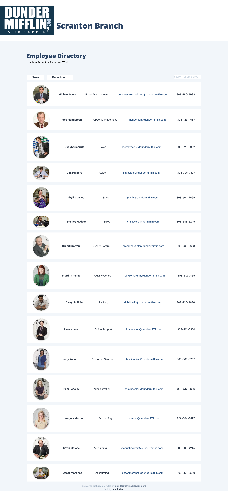

# Dunder Mifflin Employee Directory  

### Description
As a manager of a small paper company-in Scranton,PA- I want to be able to view my entire employee directory at once so that I have quick access to their information.

## Table of contents
* [Description](#Description)
* [Version](#Version)
* [Deployed Project](#Deployed)
* [Features](#Features)
* [Installation](#Installation)
* [Usage](#Usage)
* [Contributors](#Contributors)
* [Questions](#Questions)
* [License](#License)

### Version 
0.1.0

### Deployed Project
https://s2hon.github.io/employee-directory/

### Features
* React
* Node.js
* TailwindCSS

## Installation
go to the deployed link above or git clone the whole repo to run the app locally.

## Usage
    npm i 

to install all packages and initalize, then 

    npm run watch

## Contributors
s2hon

## Questions
Follow me on GitHub:  
Ask me anything: staci.shon@gmail.com  

## License
MIT © Staci Shon